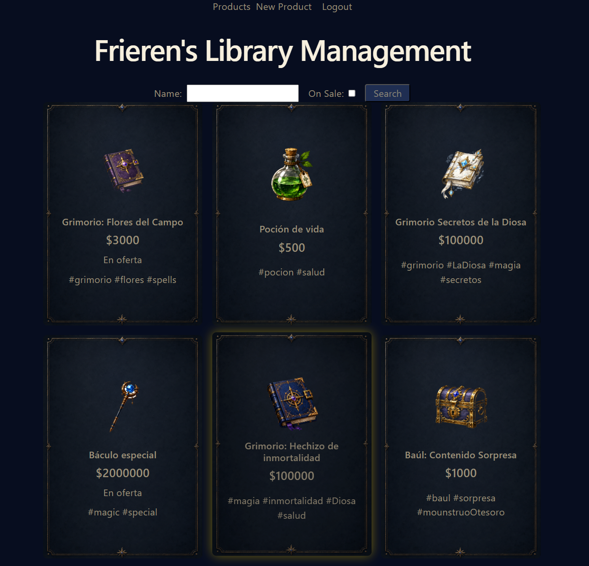

# Frontend CRUD aplicación construida con React, TypeScript, React Router y APIs REST.


## Acciones que permite realizar

- Publicar producto
- Eliminar producto, antes de eliminar pide al usuario confirmar
- Login
- Logout, antes de cerrar sesión pide al usuario confirmar
- Visualizar listado de productos
- Visualizar detalle de producto

Cada acción se hace a través de peticiones a una API REST la cual solo permite realizar operaciones como GET/POST/DELETE 
si el usuario está autenticado. Esas peticiones solo se logran si la petición contiene el TOKEN JWT 
para su autenticación. Si el usuario no está logueado únicamente puede visualizar la pagina de la ruta "/login"
las demas rutas se encuentran protegidas utilizando el componente ProtectedRoute.

---

# Aprendizajes

Aprendizajes de frontend junto con React y tipado utilizando TypeScript:

- Desarrollo de SPA
- Consumo de APIs REST
- Autenticación basada en JWT
- Rutas protegidas
- Formularios controlados y validaciones
- Gestión de estado con Hooks
- Custom Hooks reutilizables
- Manejo de archivos e imágenes
- Navegación y enrutamiento con React Router
- Arquitectura modular basada en features

---

## Instalación

1. Clonar el repositorio
```
git clone <url-del-repo>
cd arcane-library-management
```

2. Instalar dependencias
```
npm install
```

3. Iniciar la aplicación
```
npm run dev
```

## Complementos

El proyecto contiene en la carpeta de assets, imágenes para la creación de tus productos con la temática de magia/videojuego.

## Requisitos

Este proyecto consume una API externa con un backend que utiliza un archivo JSON como base de datos.

https://github.com/alce65/sparrest.js

Ejecución del API:

1. Instalar dependencias:
```
npm install
```

2. Ejecutar la aplicación
```
npm start
```


